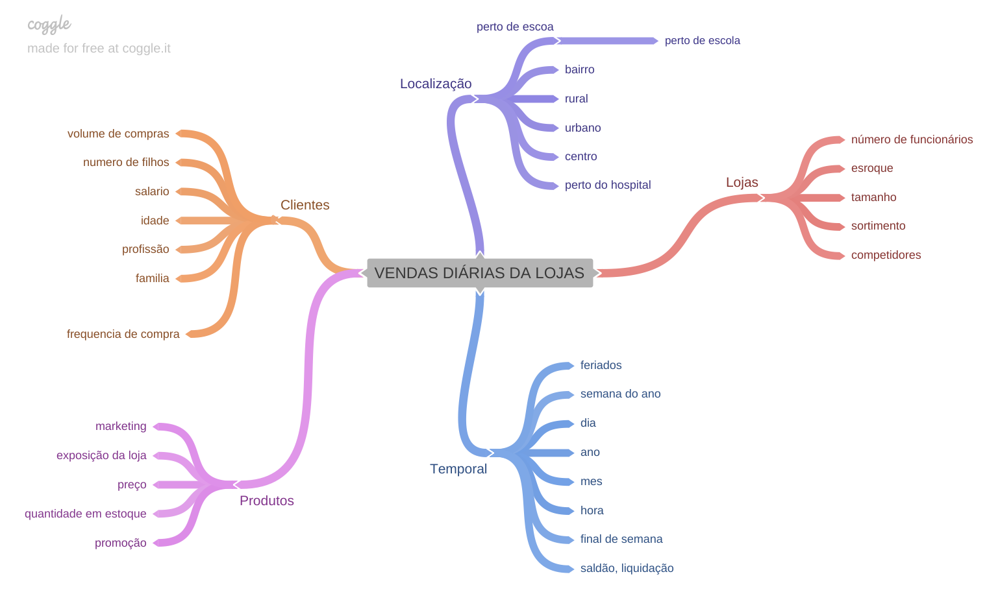
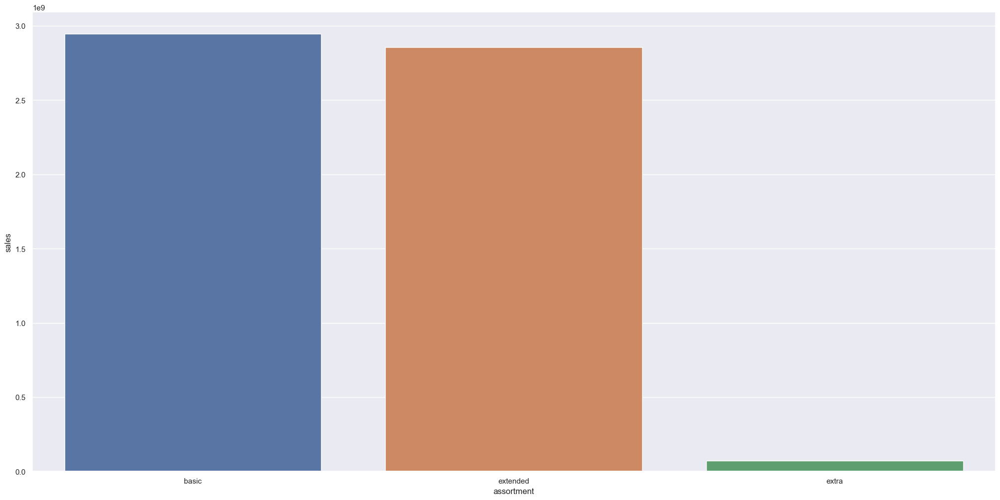
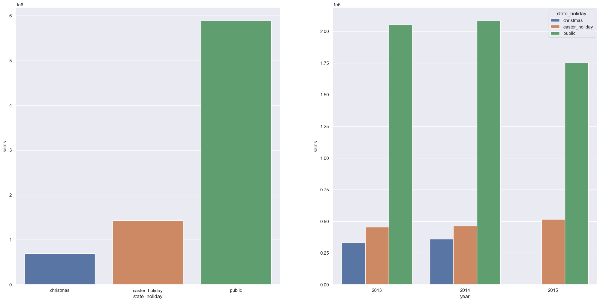
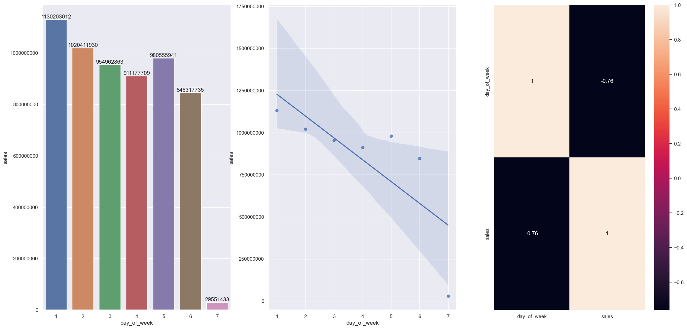
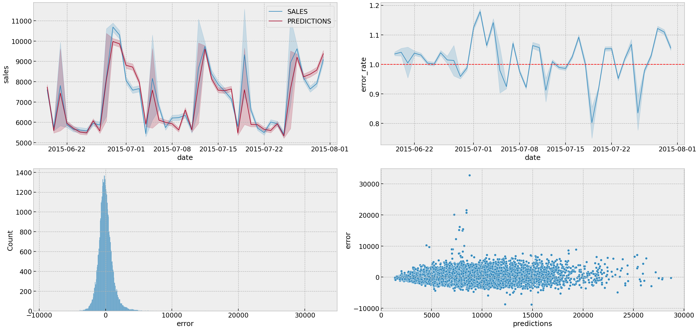

# Projeto: Previsão de Vendas das Lojas Rossmann

Dataset Rossmann: [Rossmann Sales](https://www.kaggle.com/competitions/rossmann-store-sales)

## 1. Problema de negócio

Rossmann opera mais de 3.000 drogarias em 7 países europeus. Atualmente, os gerentes das lojas Rossmann têm a tarefa de prever suas vendas diárias com até seis semanas de antecedência. As vendas nas lojas são influenciadas por muitos fatores, incluindo promoções, concorrência, feriados escolares e estaduais, sazonalidade e localidade. Com milhares de gestores individuais prevendo vendas com base em circunstâncias específicas, a precisão dos resultados pode ser bastante variada.

O CFO possui a necessidade de reformar as lojas da rede de farmácias, para melhorar a estrutura das lojas e atender melhor o público. Para tanto, ele necessita que os gerentes das lojas enviem a previsão de receita das próximas 6 semanas para que ele providencie o valor que será investido por cada loja no processo de reforma.

Dessa forma, a ideia deste projeto é auxiliar na tomada de decisão, provendo resultados das previsões de cada loja de forma automática, possibilitando a consulta das previsões através de um Bot do aplicativo Telegram.

## 2. Premissas do negócio

1. Para a previsão foram consideradas apenas lojas que tenham o valor de vendas maior que 0.
2. Dias em que as lojas estavam fechadas foram descartados.
3. As lojas que não possuem dados de competidores próximos tiveram o valor da distância fixada em 200.000

## 3. Descrição dos Dados

| Atributo | Descrição |
| --- | --- |
| Store | Identificador único de cada loja |
| Date | Data em que ocorreu o evento de venda |
| DayOfWeek | Variável numérica que representa o dia da semana |
| Sales | Valor de vendas do dia |
| Customers | Quantidade de clientes na loja no dia |
| Open | Indicador para loja aberta = 1 ou loja fechada = 0 |
| StateHoliday | Indica se o dia é feriado de estado. a = Feriado público, b = Feriado de páscoa, c = Natal, 0 = Não há feriado |
| SchoolHoliday | A loja foi ou não fechada durante o feriado escolar |
| StoreType | Indica o modelo de lojas. Pode variar entre a, b, c, d |
| Assortment | Indica o nível de variedade de produtos: a = básico, b = extra, c = estendido |
| CompetitionDistance | Distância (em metros) para o competidor mais próximo |
| CompetitionOpenSince [Month/Year] | Indica o ano e mês em que o competidor mais próximo abriu |
| Promo | Indica se a loja está com alguma promoção ativa no dia |
| Promo2 | Indica se a loja deu continuidade na promoção: 0 = loja não está participando, 1 = loja participando |

## 4. Estratégia da solução

O método CRISP-DS (*Cross Industry Process Data Science*) é originalmente utilizado na indústria para gerenciar processos, foi adaptado para o mundo de Data Science.

O CRISP-DS consiste em 9 etapas bem definidas e a cada iteração completa do ciclo, uma versão da solução é criada, sendo a primeira iteração um produto funcional que pode ser aperfeiçoado ao longo do tempo.

### 4.1 Etapas do CRISP-DS

1. **Problema de Negócio:** Etapa que consiste no recebimento da questão de negócio que pode ser uma pergunta ou um pedido feito pelo dono da empresa, no caso desse projeto é feita a questão de negócio por parte do CFO da Rede Rossmann.
2. **Entendimento do Negócio:** Entender a dor e/ou real necessidade.
3. **Coleta dos Dados:** Essa etapa normalmente é feita através de queries em bancos de dados, unindo (ou não) as tabelas e armazenando localmente a fim de desenvolver a solução.
4. **Limpeza dos Dados:** Essa etapa consiste em limpar os dados identificando os tipos de dados, se há acentos ou caracteres especiais, se há dados faltantes, dados duplicados...
5. **Exploração dos Dados:** Nessa etapa explora-se qual ou quais variáveis impactam o fenômeno que estamos modelando. Nesse projeto vamos modelar o fenômeno de previsão de vendas, identificando as correlações para ter uma ideia do que impacta a venda positivamente ou negativamente.
6. **Modelagem dos Dados:** Processo de preparação dos dados, separando em treino e teste, encoding de variáveis categóricas, transformação de dados da variável resposta, que nesse caso são as vendas.
7. **Algoritmos de Machine Learning:** Aplicar os modelos de machine learning aos dados que foram modelados.
8. **Avaliação do Algoritmo:** Criar um *conjunto de erros* para ter uma avaliação da acurácia, calculando `MAE`, `MAPE`,`RMSE`, `Accuracy`.
9. **Modelo em Produção:** Publicação do algoritmo, deixando público e de fácil acesso.

### 4.2 Ferramentas utilizadas

1. Linguagem de Programação Python
2. Versionador Git
3. Protipação desenvolvida com VSCode em interagração com Jupyter Notebook
4. Serviço de hospedagem dna nuvem com [Render](https://render.com/)
5. Manipulação de Dados utilizando Python
6. Algoritmos de Machine Learning utilizando a biblioteca [Scikit-Learn](https://scikit-learn.org/)

## 5. Top 3 Insights

Para auxiliar na construção das hipóteses, foi criado um Mindmap.

De um total de 30 hipóteses, 12 foram selecionadas e geraram alguns insights, abaixo é possível visualizar alguns deles:

### Insight 01: Lojas com maior sortimento deveriam vender mais.

- Compara o assortment com as vendas
- **FALSA:** Pois lojas com MAIOR sortimento vendem MENOS.

### Insight 02: Lojas abertas durante o feriado de natal deveriam vender mais.

- Agrupamento das vendas por feriado: natal, páscoa e feriados públicos.
- **FALSA:** Lojas ABERTAS durante o feriado de natal VENDEM MENOS.

### Insight 03: Lojas deveriam vender menos aos finais de semana.

- Soma das vendas agrupadas pelo dia da semana
- **VERDADEIRA:** Lojas vendem MENOS aos finais de semana.

## 6. Modelos de Machine Learning

Nesse primeiro ciclo foram selecionados 5 algoritmos, dentre esses o que tivesse a melhor seria selecionado para a conclusão dessa etapa do CRISP-DS, a seguir serão listados esses algoritmos.

Algortimos selecionados:

- Average Model
- Linear Regression
- Linear Regression - Lasso
- Random Forest Regressor
- XGBRegressor

Após o treinamento e teste dos algormitos, foi utilizado o método de seleção de variáveis Boruta, auxiliando a escolha das features mais relevantes para o modelo.

## 7. Escolha do Modelo de Machine Learning

### 7.1 Métrica reportada para negócio

Por não precisar se aprofundar em questões técnincas e se melhor compreendida pela equipe de negócio a métricas escolhida foi a `MAPE`, por representar uma variação positiva ou negativo em valores percentuais.

### 7.2 Métricas do Algoritmos

Resultados iniciais:

| Nome do Modelo | MAE | MAPE | RMSE |
| --- | --- | --- | --- |
| Average Model | 1354.80 | 0.21 | 1835.14 |
| Linear Regressor | 1869.92 | 0.30 | 2667.52 |
| Lasso | 1891.19 | 0.29 | 2741.00 |
| Random Forest Regressor | 731.14 | 0.11 | 1075.68 |
| XGBoost Regressor | 885.34 | 0.13 | 1298.86 |

### 7.3 Métricas do Cross Validation

Para garantir a perfomance real de cada modelo, foi aplicada a técnica de `cross validation`:

| Nome do Modelo | MAE CV | MAPE CV | RMSE CV |
| --- | --- | --- | --- |
| Linear Regression | 2079.28 +/- 303.04 | 0.3 +/- 0.02 | 2961.07 +/- 473.32 |
| Lasso | 2116.98 +/- 342.05 | 0.29 +/- 0.01 | 3059.41 +/- 504.65 |
| Random Forest Regressor | 841.13 +/- 222.99 | 0.12 +/- 0.02 | 1259.45 +/- 327.53 |
| XGBoost Regression | 1039.3 +/- 157.91 | 0.14 +/- 0.01 | 1506.64 +/- 221.66 |

### 7.4 Escolha do Modelo

Podemos observar nas métricas do algortimos que o `Random Forest Regressor` performou um pouco melhor que os demais, abaixo vamos as considerações:

1. A diferença do valor do erro do Random Forest para o XGBoost foi pequena.
2. Apesar de ter uma perfomance melhor que o XGBoost, o Random Forest Regressor demora mais para ser executado e como necessitamos de rapidez na entrega do CRISP, o XGBoost consegue entregar um resultado semelhante em menos tempo.
3. O XGBoost ocupa menos espaço de armazenamento, tornando assim a sua implementação menos custosa em servidores na nuvem.

### 7.5 Ajuste dos Hiperparâmetros

A técnica utilizada foi a`Random Search` a fim de buscar os melhores parâmetros, seguem os testes:

| Tentativa | Modelo | MAE CV | MAPE CV | RMSE CV |
| --- | --- | --- | --- | --- |
| 0 | XGBoost Regressor | 807.96 +/- 88.51 | 0.11 +/- 0.01 | 1184.07 +/- 166.03 |
| 1 | XGBoost Regressor | 1278.31 +/- 68.19 | 0.17 +/- 0.0 | 1879.1 +/- 130.60 |
| 2 | XGBoost Regressor | 815.53 +/- 96.91 | 0.11 +/- 0.01 | 1191.49 +/- 168.45 |
| 3 | XGBoost Regressor | 836.07 +/- 85.49 | 0.11 +/- 0.01 | 1224.71 +/- 165.39 |
| 4 | XGBoost Regressor | 1242.9 +/- 67.79 | 0.17 +/- 0.0 | 1799.17 +/- 123.12 |
| 5 | XGBoost Regressor | 912.24 +/- 95.0 | 0.12 +/- 0.01 | 1308.82 +/- 165.37 |
| 6 | XGBoost Regressor | 798.35 +/- 98.79 | 0.11 +/- 0.01 | 1170.37 +/- 175.05 |
| 7 | XGBoost Regressor | 808.48 +/- 100.63 | 0.11 +/- 0.01 | 1180.79 +/- 174.26 |
| 8 | XGBoost Regressor | 1012.38 +/- 67.08 | 0.13 +/- 0.0 | 1487.65 +/- 139.59 |
| 9 | XGBoost Regressor | 933.83 +/- 82.89 | 0.12 +/- 0.01 | 1368.69 +/- 153.19 |

Como podemos observar na tabela acima a tentativa 6 foi a escolha dos melhores parâmetros

> | 6 | XGBoost Regressor | 798.35 +/- 98.79 | 0.11 +/- 0.01 |	1170.37 +/- 175.05
> 

### 7.6 Perfomance do Modelo

## 8. Resultado do Negócio

Abaixo está uma demonstração das 5 primeiras linhas do dataset,

| store | predictions | worst_scenario | best_scenario | MAE | MAPE |
| --- | --- | --- | --- | --- | --- |
| 292 | 108699.48 | 105333.59 | 108700.09 | 3365.90 | 0.60 |
| 909 | 227702.23 | 219932.69 | 227702.75 | 7769.54 | 0.52 |
| 902 | 205041.27 | 203497.12 | 205041.65 | 1544.14 | 0.39 |
| 170 | 207886.55 | 206374.80 | 207886.92 | 1511.74 | 0.38 |
| 876 | 195984.23 | 191873.99 | 195984.57 | 4110.25 | 0.34 |

### 8.1 Perfomance Total

| Scenario | Values |
| --- | --- |
| predições | R$ 289,617,792.00 |
| pior cenário | R$ 288,737,682.22 |
| melhor cenário | R$ 289,617,931.66 |

### 8.2 Distribuição das Lojas pelo MAPE

![store_mape][img/store_mape.png]

## 9. Conclusões

Como o objetivo era entregar valor para o negócio de maneira rápida e eficaz, esse primeiro ciclo resolveu o problema do CFO, disponibilizando a previsão de faturamento das lojas.
Com a impementação do  Bot, facilitará quando o CFO quiser saber como está o faturamento de cada loja, visto que esse modelo de solução pode ser acessado de qualquer local ou dispositivo conectado a internet.

## 10. Próximos Passos

1. Criar uma aplicação Web e disponibilizar as análises para os gerentes.
2. Tentar melhorar a perfomance dos algoritmos
